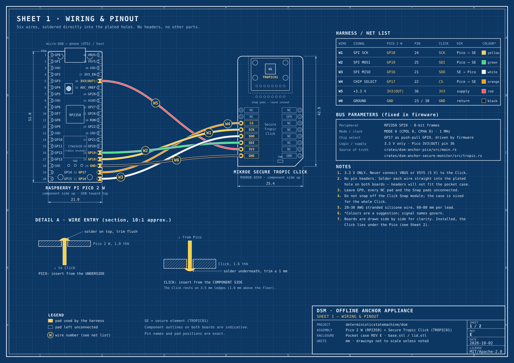
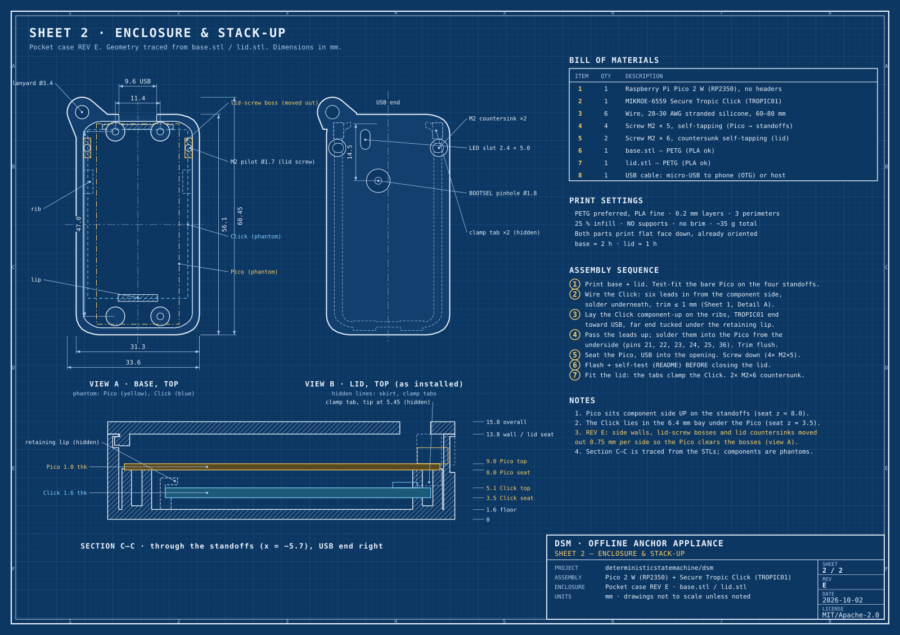

<!-- SPDX-License-Identifier: MIT OR Apache-2.0 -->
# DSM Offline Anchor Appliance: Assembly Blueprint

**Rev E · pocket case · Raspberry Pi Pico 2 W + MIKROE Secure Tropic Click (TROPIC01)**

This guide covers building the hardware anchor that DSM uses for offline bearer transfer. The appliance has two parts: an RP2350 microcontroller (on a Raspberry Pi Pico 2 W) and a TROPIC01 secure element (on a MIKROE Secure Tropic Click). They are joined by six wires and fit together in a 3D-printed case about the size of a key fob. The appliance plugs into a phone over USB-OTG.

The appliance proves **device identity only**. Transfer uniqueness is a software property of the DSM state machine, and the firmware is not the transfer authority. See `crates/dsm-anchor-pico/src/main.rs` for the authority model, and see [`docs/bench-proofs/`](../../bench-proofs/) for the silicon proof logs.

| Sheet | Contents |
|---|---|
| [Sheet 1: Wiring & pinout](sheet-1-wiring.svg) | Both boards' pinouts, the six-wire harness, net list, SPI bus parameters, and wire-entry detail |
| [Sheet 2: Enclosure & stack-up](sheet-2-enclosure.svg) | Dimensioned base and lid traced from the STLs, the stack-up section, BOM, print settings, and assembly sequence |
| [blueprint.pdf](blueprint.pdf) | Both sheets in one file, for printing |





---

## 1. Bill of materials

| # | Qty | Part | Notes |
|---|---|---|---|
| 1 | 1 | **Raspberry Pi Pico 2 W** (RP2350) | Get it **without headers**. This is the board the firmware is tested on. A non-W Pico 2 has the same pinout but is untested. |
| 2 | 1 | **MIKROE-6559 Secure Tropic Click** (TROPIC01) | Use the whole board and **do not snap off** the Click Snap module. Don't fit headers. |
| 3 | 6 | Wire, 28–30 AWG stranded silicone | Cut 60–80 mm per lead. Six colours make checking easier. |
| 4 | 4 | Screw, M2 × 5 mm, self-tapping | Fixes the Pico to the standoffs (Ø1.7 pilots). |
| 5 | 2 | Screw, M2 × 6 mm, countersunk self-tapping | Fixes the lid to the base. |
| 6 | 1 | `enclosure/base.stl` | PETG preferred, PLA works. |
| 7 | 1 | `enclosure/lid.stl` | PETG preferred, PLA works. |
| 8 | 1 | USB cable, micro-USB to phone (OTG) or computer | |

**Tools:** a fine-tip soldering iron, flux, flush cutters, a small Phillips driver, a multimeter, and a 3D printer.

Datasheets: [Secure Tropic Click (MIKROE-6559)](https://www.mouser.com/datasheet/2/272/Secure_Tropic_Click-3574756.pdf) · [TROPIC01](https://download.mikroe.com/documents/datasheets/TROPIC01_datasheet.pdf)

## 2. Wiring

The firmware fixes the pin map (`crates/dsm-anchor-pico/src/main.rs` and `crates/dsm-anchor-secure-monitor/src/tropic.rs`), so the wiring below is the only one that works.

| Wire | Signal | Pico 2 W | Pico pin | Click pad (left header) | Direction | Suggested colour |
|---|---|---|---|---|---|---|
| W1 | SPI SCK | GP18 | 24 | SCK | Pico → SE | yellow |
| W2 | SPI MOSI | GP19 | 25 | **SDI** | Pico → SE | green |
| W3 | SPI MISO | GP16 | 21 | **SDO** | SE → Pico | white |
| W4 | Chip select | GP17 | 22 | CS | Pico → SE | orange |
| W5 | +3.3 V | 3V3(OUT) | 36 | 3V3 | supply | red |
| W6 | Ground | GND | 23 (or 38) | GND | return | black |

**Bus:** RP2350 SPI0, mode 0 (CPOL 0, CPHA 0), 1 MHz, 8-bit frames. CS is an ordinary push-pull GPIO that the firmware drives.

> [!WARNING]
> **3.3 V only.** The TROPIC01 runs from the Pico's 3V3(OUT), pin 36. Never connect VBUS or VSYS (5 V) to the Click.

> [!NOTE]
> MOSI goes to **SDI** and MISO comes from **SDO**: the Click labels its pads from the chip's point of view. Swapping these two wires is the most common wiring mistake.

Leave GPO, every NC pad, and both rows of Click Snap pads unconnected. The MIKROE datasheet says the shipped TROPIC01 firmware doesn't support GPO.

## 3. Print the enclosure

Print `enclosure/base.stl` and `enclosure/lid.stl` with 0.2 mm layers, 3 perimeters, 25 % infill, **no supports** and no brim. Both parts are already oriented flat face down. The base takes about 2 h and the lid about 1 h, using roughly 35 g of filament in total. See [`enclosure/PRINT-NOTES.txt`](enclosure/PRINT-NOTES.txt).

Key dimensions, measured from the STLs (Sheet 2 has the full drawing):

| Feature | Value |
|---|---|
| Body (without lanyard tab) | 31.3 × 56.1 mm |
| Overall with tab | 33.6 × 60.45 mm |
| Assembled height | 15.8 mm |
| Cavity | 27.7 × 52.5 mm, floor 1.6 mm |
| Pico standoffs | 11.4 × 47.0 mm pattern, seat at z = 8.0, Ø1.7 pilots |
| Lid screws | M2 pilots Ø1.7 in the side-wall bosses, 25.8 mm apart |
| Click seat (ribs + far-end lip) | z = 3.5 |
| USB opening | 9.6 mm wide, sill at z = 8.8 |
| Lid | 2.0 mm plate, Ø1.8 BOOTSEL pinhole, 2.4 × 5.0 LED slot, 2 clamp tabs reaching to z = 5.45 |

## 4. Assemble

Inside the case the Click lies **under** the Pico. Sheet 1 draws the two boards side by side only to make the wiring readable.

1. **Test-fit.** Set the bare Pico, component side up, on the four standoffs with its USB connector in the opening. Then take it out again.
2. **Wire the Click.** Push each of the six leads through its plated hole **from the component side**. Solder them on the underside and trim the joints to **≤ 1 mm**, because the Click rests on 3.5 mm ledges only 1.9 mm above the floor (Sheet 1, Detail A).
3. **Seat the Click.** Lay it component side up on the side ribs, with the **TROPIC01 (Snap) end toward the USB end** and the far end tucked under the retaining lip. In this orientation the header joints clear the side ribs.
4. **Wire the Pico.** Bring the leads up and push them into the Pico **from the underside**: pins 21, 22, 23, 24, 25 and 36. Solder them on top and trim flush. Keep the wires along the side walls and away from the USB connector and BOOTSEL button.
5. **Check before power.** With a multimeter, confirm that each lead runs from its Pico pin to its Click pad as in the table above. Confirm there is **no short between 3V3 and GND**, and that there is no continuity between neighbouring SPI lines.
6. **Screw down the Pico** with 4 × M2 × 5 mm screws. Don't overtighten into PETG.
7. **Flash and self-test before closing** (section 5).
8. **Close the lid.** The two tabs at the USB end clamp the Click's edges. Fix the lid with 2 × M2 × 6 mm countersunk screws. The BOOTSEL button stays reachable through the pinhole with a paperclip, and the LED shows through the slot.

## 5. Firmware bring-up and self-test

The firmware lives in [`crates/dsm-anchor-pico`](../../../crates/dsm-anchor-pico). That crate is excluded from the host workspace (it builds for thumbv8m only), and its README has the full build and flash steps. In short:

```sh
# libtropic-rs must be checked out where crates/dsm-anchor-pico/Cargo.toml expects it:
#   crates/dsm-anchor-pico/../../../../libtropic-rs/tropic01
cd crates/dsm-anchor-pico
cargo build --release                       # thumbv8m.main-none-eabihf (default target)

# Hold BOOTSEL (paperclip through the lid pinhole once closed) while plugging in USB, then:
picotool load -v -x -t elf target/thumbv8m.main-none-eabihf/release/dsm-anchor-pico

python3 tools/anchor_host_test.py          # STATUS → PREPARE → COMMIT → EMIT → FINALIZE → STATUS
```

When it's working, the appliance enumerates over USB-CDC as **"DSM Anchor"** (VID `0x1209`, PID `0xD5A1`). The DSM Android app's USB filter (`dsm_client/android/app/src/main/res/xml/pico_device_filter.xml`) matches that ID when the appliance is plugged into a phone over USB-OTG.

> [!CAUTION]
> **Assembly and self-test change nothing permanent. The two runbooks below do,** and neither is part of building the appliance. Read each one in full and dry-run it on a sacrificial board first.
> - [`crates/dsm-anchor-pico/scripts/anchor-secure-boot/RUNBOOK.md`](../../../crates/dsm-anchor-pico/scripts/anchor-secure-boot/RUNBOOK.md) burns RP2350 secure-boot and host-secret OTP fuses. A wrong value bricks the board.
> - [`crates/dsm-anchor-hw-verifier/BENCH_BURN_RUNBOOK.md`](../../../crates/dsm-anchor-hw-verifier/BENCH_BURN_RUNBOOK.md) does the TROPIC01 verifier-slot and counter set-up, which consumes a pairing slot permanently.

## 6. Troubleshooting

| Symptom | Likely cause |
|---|---|
| No USB device appears | Firmware not flashed, or the cable is charge-only. Re-enter BOOTSEL and reflash. |
| Click PWR LED is off | W5 (3V3) or W6 (GND) is open. Check pin 36 and pin 23. |
| USB works, but the chip-ID / handshake step fails | SDO and SDI are swapped (W2/W3), CS is on the wrong pin, or a joint is cold. The firmware waits about 1 s after power-up before its first SPI transaction. |
| The Click rocks or won't lie flat | Underside joints are too tall. Trim them to ≤ 1 mm. |
| The lid won't seat | A wire is caught under the lid skirt or over the USB connector. Re-route it along the wall. |

## 7. Enclosure revisions

- **Rev E (current).** The side walls, the two lid-screw bosses and the matching lid countersinks moved out 0.75 mm per side, so the case is 1.5 mm wider. In Rev D the bosses sat too close to the Pico and had to be shaved by hand before the Pico and its USB connector would line up. Nothing on the centre line moved: the Pico standoffs, USB opening, BOOTSEL pinhole, LED slot, Click ribs, retaining lip and lid clamp tabs are where they were. [`src/widen_rev_e.py`](src/widen_rev_e.py) records exactly how Rev E was derived from Rev D.
- **Missing stencil.** `PRINT-NOTES.txt` refers to a `stencil.stl` alignment plate for checking the BOOTSEL and LED positions. That file isn't in this folder yet.

## Files

```
docs/hardware/offline-anchor/
├── README.md               this guide
├── sheet-1-wiring.svg      blueprint sheet 1
├── sheet-2-enclosure.svg   blueprint sheet 2
├── blueprint.pdf           both sheets, printable
├── enclosure/
│   ├── base.stl            case body (Rev E)
│   ├── lid.stl             lid (Rev E)
│   └── PRINT-NOTES.txt     slicer settings
└── src/                    generators for the two sheets
    ├── common.py           (sheet 1 has no dependencies;
    ├── sheet1.py            sheet 2 traces the STLs and needs
    ├── sheet2.py            `pip install trimesh numpy`)
    └── widen_rev_e.py      how Rev E was derived from Rev D
```

To regenerate the drawings after changing the STLs or the pin map, run `python3 src/sheet1.py && python3 src/sheet2.py`.
